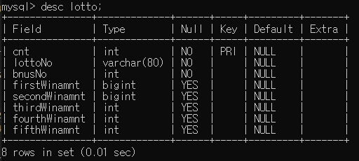
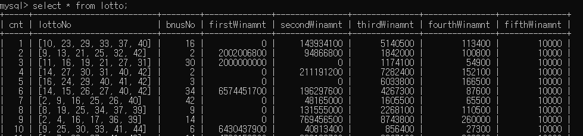
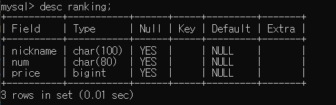

# LottoGame
👩‍💻2021 1학기 이니로 웹 프로젝트
---
### 개발환경
- Spring 4.3.3
- Tomcat 8.5
- MySQL 8.0.22
- django 3.2.3

### DB
- id : lotto
- password : game
- DB명 : lottoDB
- 테이블명 : lotto, ranking    

- 21.05.17: 크롤링 수정
  - winnums -> lottoNo/bnusNo 로 구분
  - 리스트로 번호 받아오지 않고 각각 받아옴(lottoNo -> num1, num2, ... ,num6, bonus)
- db수정
  - 이름 직관적으로 firstWinamnt -> price1, ..., price5         

- ranking table
- 이 테이블을 rest framework로 /api/rank/ 에 보냄
- 이슈 : 닉네임을 어떻게 받을지
### 참고 블로그
- [Spring 프로젝트 세팅 및 DB 연결](https://all-record.tistory.com/176?category=733072)
### 에러
- [Junit](https://subdong2.tistory.com/82)
- [JDBC연결](https://yunyoung1819.tistory.com/89)
- [log4j.xml에서 DTD에러](https://blog.itpaper.co.kr/spring-log4j-error/)